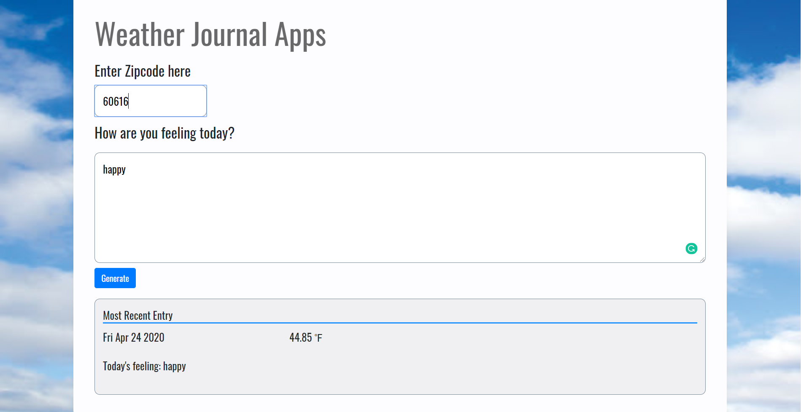

# Weather-Journal App Project

## Overview
This is an asynchronous web app that uses Web API and user data to dynamically update the UI. Users enter zipcode and today's feelings. Then the page will dynamically update with the most recent entry with today's date, today's temperature, and today's feelings.

## Installation
1. Download the source file in Github
2. In terminate: `npm run start` -- need to have node.js install first
3. On browser: run http://localhost:8000/

## API Credentials
OpenWeatherMap.com

## Development Strategy
1. Start by setting up the project environment. Make sure Node is installed from the terminal. Install the packages Express, Body-Parser, and Cors from the terminal and them include them in server.js file.
2. Add a GET route that returns the projectData object in the server code Then, add a POST route that adds incoming data to projectData.
3. Acquire API credentials from OpenWeatherMap website. Use your credentials and the base url to create global variables at the top of the app.js code.
4. After successful retrieval of the weather data, then chain another Promise that makes a POST request to add the API data, as well as data entered by the user, to this app.
5. Finally, chain another Promise that updates the UI dynamically Write another async function that is called after the completed POST request. This function should retrieve data from our app, select the necessary elements on the DOM (index.html), and then update their necessary values to reflect the dynamic values for:
*Temperature
*Date
*User input

## Website sample view

